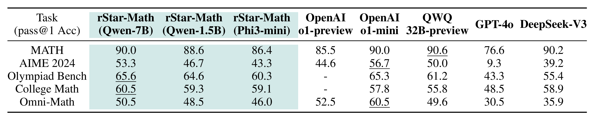
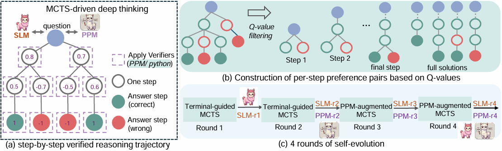

<h1 align="center">
<br>
rStar-Math
</h1>

<p align="center">
📃 <a href="https://huggingface.co/papers/2501.04519" target="_blank">[Paper]</a> 
</p>

Repo for "[rStar-Math: Small LLMs Can Master Math Reasoning
with Self-Evolved Deep Thinking](https://huggingface.co/papers/2501.04519)".

Authors: [Xinyu Guan](https://gxy-2001.github.io/)\*, [Li Lyna Zhang](https://www.microsoft.com/en-us/research/people/lzhani/)\*, Yifei Liu, Ning Shang, Youran Sun, Yi Zhu, Fan Yang, Mao Yang

<p align="center">
    
        <br>
    <em>Table 1: rStar-Math enables frontier math reasoning in SLMs via deep thinking over 64 trajectories.</em>
</p>

## News 

- **[07/15/2025]** Our rStar-Coder [paper](https://arxiv.org/abs/2505.21297) and [dataset](https://huggingface.co/datasets/microsoft/rStar-Coder) are released. We introduce a large-scale, verified dataset of 418K competition-level code problems with **test cases** of varying difficulty, enabling small LLMs (1.5B-14B) to achieve frontier-level code reasoning performance.
- **[02/10/2025]** We are hiring interns! If you are interested in improving LLM reasoning, please send your CV to lzhani@microsoft.com.
- **[01/21/2025]** Our code has been open-sourced. 
- **[01/09/2025]** Our paper is released: https://huggingface.co/papers/2501.04519.


Note: Our prior work [Mutual Reasoning Makes Smaller LLMs Stronger Problem-Solvers](https://huggingface.co/papers/2408.06195) is open-sourced on the `rStar-mutualreasoning` branch.


## Contents
- [Introduction](#Introduction)
- [Setup](#Setup)
- [Usage](#Usage)
- [Citation](#Citation)


## Introduction
We present rStar-Math to demonstrate that small language models (SLMs) can rival or even surpass the math reasoning capability of OpenAI o1-mini, without distillation from superior models. rStar-Math achieves this by exercising "deep thinking" through Monte Carlo Tree Search (MCTS), where a math policy SLM performs test-time search guided by an SLM-based process reward model. The diagram below presents an overview of the rStar-Math framework, highlighting its core components and processes.

<p align="center">
  
</p>

## Setup

We recommend using conda for environment management and executing the code on an A100 80G GPU equipped with CUDA 12.4.
1. Create a Python environment with python3.11: 
```
conda create -y --name rstar python=3.11
conda init && source deactivate # init
conda activate rstar
```
2. Install requirements
```
pip install --upgrade pip
pip install -r requirements.txt

# optional: install flash-attn 2
# pip install flash-attn --no-build-isolation
```
3. Install [evaluation toolkit](https://arxiv.org/abs/2404.13925)
```
git clone https://github.com/MARIO-Math-Reasoning/MARIO_EVAL.git
cd MARIO_EVAL
cd latex2sympy && pip install . && cd ..
pip install -e .
cd ..
```

vllm 0.6.6 requires torch 2.5.1, which requires CUDA 12.4. If your CUDA version is lower than 12.4, you can execute the following command:
```
export LD_LIBRARY_PATH=$(python -c "import site; print(site.getsitepackages()[0] + '/nvidia/nvjitlink/lib')"):$LD_LIBRARY_PATH
```
This will help prevent the error: undefined symbol: __nvJitLinkComplete_12_4, version libnvJitLink.so.12.

## Usage

### Generate Training Data 

Most of the math problems are sourced from [NuminaMath](https://huggingface.co/datasets/AI-MO/NuminaMath-CoT) and [MetaMath](https://huggingface.co/datasets/meta-math/MetaMathQA). To generate your own data, reformat questions and answers into the [eval_data](eval_data/aime2024_test.json) format.

#### Bootstrapping round 

You may choose to use the following command to generate train data. Please ensure that sufficient GPU memory is allocated for the model, and modify the `CUDA_VISIBLE_DEVICES` as well as the `llm_gpu_memory_utilization` and `tp` parameters in the configuration file.

```bash
MODEL="deepseek-ai/DeepSeek-Coder-V2-Instruct"  
QAF="train set path"
CFG="config/sample_mcts.yaml"
CUDA_VISIBLE_DEVICES="0,1,2,3,4,5,6,7" python main.py --qaf $QAF --custom_cfg $CFG --model_dir $MODEL
```

#### Round2-4: From rStar Policy Model and Reward Model

After training the policy and reward models, use this command to generate enhanced training data.

```bash
MODEL="policy model dir"  
RM="reward model dir" 
QAF="train set path"
CFG="config/sft_sample_mcts.yaml"
CUDA_VISIBLE_DEVICES="0" python main.py --qaf $QAF --custom_cfg $CFG --model_dir $MODEL --reward_model_dir $RM
```

### Extracting SFT and RM Training Data
We provide scripts to extract the complete trace from MCTS data, which can be used for both data analysis and the construction of training datasets for Supervised Fine-Tuning and Reward Modeling.

#### Extract SFT Training Data
Run the following command to extract the complete trace from your MCTS data directory, this command collects all the detailed information from the MCTS runs, which is useful for further analysis or to prepare data for training:

```bash
python extra_sft_file.py --data_dir "MCTS file dir" --output_file "sft_extra_result.jsonl"
```

you can sample the data to create a dataset for SFT training by running:

```bash
python train/sample_sft_data.py --data_file "sft_extra_result.jsonl" --output_file "sft.json" --n 2
```

#### Extract RM Training Data

Run the following command to extract all step-level pair preference data from your MCTS files.

```bash
python extra_rm_file.py --data_dir "MCTS file dir" --output_file "rm_extra_result.jsonl"
```

sample the data for Reward Modeling:

```bash
python train/sample_rm_data.py --data_file "rm_extra_result.jsonl" --output_file "rm.json"
```


### Open-Source Training Datasets

We have released our SFT training data and PPM training data, which you can directly use to reproduce our results:

[SFT-Trainset](https://huggingface.co/datasets/ElonTusk2001/rstar_sft)

[PPM-Trainset](https://huggingface.co/datasets/ElonTusk2001/rstar_ppm)


### Inference & Evaluation

#### MCTS Inference with Policy Model and Reward Model

To reproduce the results in our main table, run the provided command will yield a mcts result file. For each run, a trajectory is selected based on the highest overall response score. Refer to `run_example.sh` for a demonstration of executing multiple trajectories. Our final score is determined by a majority vote on the top K highest-reward trajectories.

```bash
MODEL="policy model dir"
RM="reward model dir" 
QAF="test set path"
CFG="config/sft_eval_mcts.yaml"
CUDA_VISIBLE_DEVICES="0" python main.py --qaf $QAF --custom_cfg $CFG --model_dir $MODEL --reward_model_dir $RM
```

Executing the command or further increasing the number of nodes may lead to enhanced performance, but it would also require a considerable amount of GPU resources. To optimize, consider reducing `n_generate_sample` and `iterations` to 16 and 8, respectively, which still delivers satisfactory results. Alternatively, replacing MCTS with step beam search improves search speed, though with a slight accuracy trade-off. Use the following command to implement this strategy.

```bash
MODEL="policy model dir"
RM="reward model dir" 
QAF="test set path"
CFG="config/sft_eval_bs.yaml"
CUDA_VISIBLE_DEVICES="0" python main.py --qaf $QAF --custom_cfg $CFG --model_dir $MODEL --reward_model_dir $RM
```


#### Greedy Decoding with Policy Model (SFT Pass@1 accuracy)

Running the following command will generate the results using Greedy Decode.

```bash
MODEL="policy model dir"
QAF="test set path"
CFG="config/sft_eval_greedy.yaml"
CUDA_VISIBLE_DEVICES="0" python main.py --qaf $QAF --custom_cfg $CFG --model_dir $MODEL
```

We've streamlined the evaluation process, enabling easy generation of greedy decode results for tasks like `gsm8k`, `math`, `math500`, `aime2024`, `amc23`, `collegemath`, `gaokao2023en`, `olympiadbench`, and `omni-math`. Results are saved in the model's directory by default.

```bash
MODEL="policy model dir"
python eval.py --model "$MODEL" --device 0 --task amc23 
# evaluate a result file
python eval_output.py --file_path $MODEL"/amc23.jsonl"
```


### Fine-tune the Policy Model and Reward Model

The training script is configured for 8*mi300x GPUs by default. For users with NVIDIA GPUs with limited VRAM, reduce `per_device_train_batch_size` and increase `gradient_accumulation_steps` accordingly. You can also enable `flash_attention_2` with the `--attn_impl flash_attention_2` flag, which maintains similar accuracy to the `eager` implementation.

Example training data is available in `train/sft_data_examples.json` and `train/rm_data_examples.json`. For SFT, we typically select the two traces with the highest average scores from MCTS. For PPM training, we pair the highest-scoring correct solution with the lowest-scoring incorrect one.

**SFT Train Script**
```bash

export NCCL_IB_DISABLE=1
export NCCL_P2P_DISABLE=0
export NLLC_P2P_LEVEL=NVL
export CUBLAS_WORKSPACE_CONFIG=:4096:8
export NCCL_BLOCKING_WAIT=0
export FLASH_ATTENTION_DETERMINISTIC=1
export MASTER_ADDR="localhost"
export MASTER_PORT="1939"
export GLOO_SOCKET_IFNAME="lo"
export NCCL_SOCKET_IFNAME="lo"


CUDA_VISIBLE_DEVICES=0,1,2,3,4,5,6,7 python3 -m torch.distributed.launch --master_addr ${MASTER_ADDR} --master_port ${MASTER_PORT} --nproc_per_node=8 --use_env train/train_SFT.py \
    --model_name_or_path "Qwen/Qwen2.5-Math-7B" \
    --data_path "data_path" \
    --data_length 10000000 \
    --bf16 True \
    --output_dir "path_to_save" \
    --num_train_epochs 2 \
    --per_device_train_batch_size 4 \
    --per_device_eval_batch_size 4 \
    --gradient_accumulation_steps 4 \
    --evaluation_strategy "no" \
    --save_strategy "steps" \
    --save_steps 100000 \
    --save_total_limit 2 \
    --learning_rate 7e-6 \
    --weight_decay 0.1 \
    --warmup_ratio 0 \
    --lr_scheduler_type "linear" \
    --logging_steps 1 \
    --fsdp "full_shard auto_wrap" \
    --fsdp_transformer_layer_cls_to_wrap 'Qwen2DecoderLayer'
    # --attn_impl flash_attention_2 # 
```

**RM Train Script**
```bash

export WANDB_DISABLED=true
export CUBLAS_WORKSPACE_CONFIG=:4096:8
export FLASH_ATTENTION_DETERMINISTIC=1

accelerate launch --num_processes=8 train/train_RM.py \
    --model_name_or_path="sft_model_path" \
    --output_dir="path_to_save" \
    --pair_json_path "data_path" \
    --per_device_train_batch_size=16 \
    --per_device_eval_batch_size=16 \
    --num_train_epochs=2 \
    --gradient_accumulation_steps=4 \
    --gradient_checkpointing=True \
    --learning_rate=7e-6 \
    --remove_unused_columns=False \
    --optim="adamw_torch" \
    --logging_steps=1 \
    --eval_strategy="steps" \
    --eval_steps=750 \
    --save_steps=750 \
    --load_best_model_at_end \
    --save_total_limit=5 \
    --max_length=2048 \
    --bf16 \
    --fsdp "full_shard auto_wrap" \
    --fsdp_transformer_layer_cls_to_wrap 'Qwen2DecoderLayer' 
    # --attn_impl flash_attention_2 

```

**Convert to RM Format**

Run the command below to convert the RM format.

```bash
python train/save_rm.py --sft_model_path "sft_model_path" --rm_ckpt_path "rm_ckpt_path" --rm_save_path "rm_save_path"
```

---


## Citation
If you find this repo useful for your research, please consider citing the paper
```
@misc{guan2025rstar,
    title={rStar-Math: Small LLMs Can Master Math Reasoning with Self-Evolved Deep Thinking},
    author={Xinyu Guan and Li Lyna Zhang and Yifei Liu and Ning Shang and Youran Sun and Yi Zhu and Fan Yang and Mao Yang},
    year={2025},
    eprint={2501.04519},
    archivePrefix={arXiv},
    primaryClass={cs.CL}
}
```
